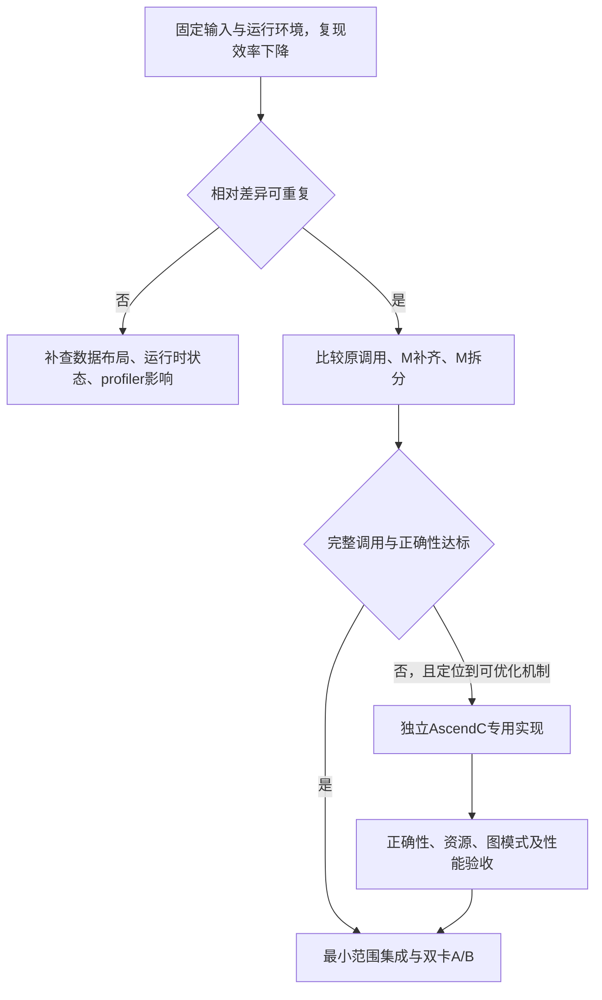

# QuantBatchMatmulV3 定向优化设计

日期：2026-09-22。状态：待实现。目标执行者：接手本仓库的算子开发 agent。

## 1. 目标和范围

首版优化 dense FFN 合并的 gate/up 投影，保持现有 W8A8 数学语义：

```text
主目标：M ∈ {15900, 15912}, K=5120, N=17408
扩展目标：M=15920（BS32 已观测，单独验收后启用）
A: INT8 ND
W: INT8 FRACTAL_NZ
weight_scale: BF16 [N]
pertoken_scale: FP32 [M]
Y: BF16 ND [M,N]
```

业务仍为双卡 TP=2、W8A8、MTP=3，配置与模型路径沿用 `01`。首版的替换边界是**量化之后的矩阵乘及其反量化输出**，原来的 `npu_dynamic_quant` 保持原样。

工作以以下结果作为目标：

- 在同机独立基准中复现 M≈15900 的单位工作量耗时升高。
- 白名单 shape 的完整调用耗时至少下降 10%，争取 15%–20%；10% 是本设计的实验进入标准，不是已有测量。
- 数值、tensor 形状/格式、图执行和 fallback 全部通过后，再进入整网 A/B。
- 首轮允许交付一个基于已有 CANN 算子的优化 wrapper；只有它们不满足条件、且证据支持继续投入时，才进入专用 AscendC 实现。

本期不扩展为通用 MatMul，不改量化精度、TP 划分、MTP 接受策略、SwiGlu 数学定义和 AllReduce；不以大 M 优化的结果承诺纯 decode 的小 M 收益。

## 2. 已确认的事实

### 2.1 同 Shape 家族的效率差异

以下均为 `K=5120,N=17408`，时间来自 `kernel_details.csv`。它是 profiling 中的 kernel 时长，不是独立 benchmark 的完整调用时长。

| 场景 | M | 次数/卡 | rank0 均值 (ms) | rank1 均值 (ms) |
| --- | ---: | ---: | ---: | ---: |
| BS16 decode | 15364 | 67 | 4.523319 | 4.519714 |
| BS16 decode | 15392 | 67 | 4.522269 | 4.517616 |
| BS16 decode | 15900 | 67 | 5.766266 | 5.761233 |
| BS16 decode | 15912 | 67 | 5.770114 | 5.756610 |
| BS16 prefill | 16384 | 67 | 4.812444 | 4.806921 |
| BS32 decode | 15364 | 67 | 4.522358 | 4.520313 |
| BS32 decode | 15900 | 67 | 5.759606 | 5.760793 |
| BS32 decode | 15912 | 67 | 5.751590 | 5.762757 |
| BS32 decode | 15920 | 134 | 5.758952 | 5.766964 |

M 从 15364 增至 15900 时，逻辑计算量增加约 3.49%，rank0 kernel 时间增加约 27.48%。两个 batch 场景及两卡均有相近现象，支持进行定向实验。

M=16384 的结果来自另一次 prefill 采集，仅用于选择对照组；它尚不能证明在本次 decode 上补齐 M 一定更快。

### 2.2 名称相同，不能宣称已经定位到 tiling 切换

本次额外核对了 rank0 原始任务记录：上述 BS16 shape、BS32 的目标及相邻 shape 都匹配到：

```text
API/kernel 显示名：
aclnnQuantMatmulWeightNz_QuantBatchMatmulV3_QuantBatchMatmulV3

底层任务名：
QuantBatchMatmulV3_ND_NZ_int8_int8_bf16_high_performance_20

Block Num=24, Mix Block Num=24
```

因此尚无证据表明它们切换了不同的 kernel 二进制。相同 kernel 可接收不同 tiling 数据；也可能是尾块、核间负载、访存或 Cube/Vector 流水引起差异。

关联 `task_time.csv` 时要同时使用 stream、task id 和时间戳，必要时加 model/context。图回放/长 trace 中 task id 会重复，仅用 `stream_id+task_id` 会误关联。本次 BS32 核对额外要求开始时间差小于 1 us，目标任务均唯一匹配。

### 2.3 实际调用与参数

已核对本机 `vllm_ascend/quantization/methods/w8a8_dynamic.py`：

```text
AscendW8A8DynamicLinearMethod.apply
  -> torch_npu.npu_dynamic_quant(x)
  -> torch_npu.npu_quant_matmul(
       quantized_x, layer.weight, layer.weight_scale,
       pertoken_scale=pertoken_scale,
       bias=bias, output_dtype=x.dtype)
  -> BF16 输出 -> 后续 SwiGlu
```

权重加载后先转置并 contiguous，再由 `maybe_trans_nz` 转成 NZ；scale 展平。`quant_model_description.json` 中主干与 MTP 的 gate/up 权重均标为 `W8A8_DYNAMIC`。首轮运行时仍应记录模块名，区分主干与 MTP；不能只凭每组 67 次就假定所有调用的来源。

设备导出的权重 storage shape 为 `[544,320,16,32]`，输入为 `[M,5120]`，输出为 `[M,17408]`。PyTorch 的逻辑 shape 与该 storage shape 不同：**不能用 reshape 手工制造 NZ 权重，也不能仅根据这四个维度推断正确的地址公式**。基准复用实际加载流程或官方 `npu_format_cast(...,29)` 并检查 format descriptor。

## 3. 算子契约

### 3.1 首版支持表

| 参数/属性 | 首版候选支持 | 不满足时 |
| --- | --- | --- |
| 设备 | 验证过的 A3 对应 SoC、同一 NPU 上的全部输入 | 回原调用 |
| 输入 | 2D、INT8、ND、连续 `[M,5120]` | 回原调用 |
| 权重 | 该模型 TP 本地投影，逻辑 `[5120,17408]`、INT8、真实 NZ descriptor | 回原调用 |
| weight_scale | 连续 BF16 `[17408]` | 回原调用 |
| pertoken_scale | 连续 FP32 `[M]` | 回原调用 |
| bias / offset | None；从设备输入列表未见非空项，运行时再次确认 | 非空回原调用 |
| 输出 dtype | BF16 | 回原调用 |
| M | 15900、15912；15920 单独通过后加入 | 回原调用 |
| 模块 | 运行时确认的 dense `gate_up_proj` 白名单 | 回原调用 |
| `_chunk_size` 分支、其他维数或布局 | 首版不替换 | 保留原分支 |

候选 operator 内部也检查契约。输入 tensor 不修改；每次输出拥有独立有效生命周期，不与下一次调用的输出或输入意外共享可写缓冲区。

### 3.2 数学与精度

无 bias/offset 时的理想数学形式：

```text
C_int32[m,n] = sum_k int32(A[m,k]) * int32(W[k,n])
Y[m,n] = cast_bf16( dequant(C_int32[m,n], weight_scale[n])
                    * pertoken_scale[m] )
```

此式不授权重排浮点乘法或改变舍入。当前 CANN 的相关 epilogue 是先做 channel scale 反量化，再乘 per-token scale，最终以 `CAST_RINT` 转输出；具体候选以相同版本 `npu_quant_matmul` 的结果为数值基准。

完整 INT8 值域下 `5120*128*128=83,886,080 < 2^31`，无 bias 的整数累加不会溢出 INT32。输出仍受 FP32 转换、scale 顺序与 BF16 舍入影响。不得用 FP16 乘加代替 INT8×INT8→INT32，或把 INT32 累加的验证简化为浮点近似。

首版不提前将两路 scale 相乘、不将 BF16 weight_scale 改成另一量化方案。默认验收要求与原算子逐元素一致；详细测试及异常处理见 [验收方案](02-quantbatchmatmulv3-validation-plan.md)。

## 4. 诊断实验与决策

先以固定同一组数据、同一权重、相同环境测 M 扫描。所有 shape 的权重和量化参数准备均在计时外完成；候选特有的复制、补齐、拼接、分配在完整调用计时内。

| 假设 | 实验 | 支持该假设需要的证据 |
| --- | --- | --- |
| M 触发了不同的 tiling 参数 | 检查 baseM/N/K、singleCoreM/N、核划分、UB/L2 参数 | 同输入格式与 dtype，仅参数边界变化对应时长跳变 |
| 尾块或任务分配损失 | 比较 15360 附近、15872 附近、15900/15912、16384 | 多轮中效率拐点重复，核/流水指标或块映射有对应变化 |
| Cube/Vector 配合不佳 | 比较 MAC、MTE、Vector 周期与等待 | 反量化/搬运/等待变化能解释新增时间，而非仅看 cube_utilization |
| 缓存或并发干扰 | 固定热权重与轮换真实权重两套测试，隔离额外负载 | 独立环境仍重复；否则先解释工作负载条件 |
| profiler 开销影响 | 无 profiler 性能测量与短窗口 profiler 分开 | 非 profiling 时间也存在相对效率下降 |

获取不了内置 host tiling 数据时记录“不可见”，不要从 kernel 名字后缀反推全部参数，也不要修改 CANN 安装目录或编造控制内置 tiling 的环境变量。Python `npu_quant_matmul` 的本机接口没有公开 baseM/baseN 参数。



若独立基准中目标 shape 与相邻 shape 的单位工作量耗时差小于测量噪声，先修正优化依据；仍可测 wrapper，但不以历史绝对 5.77 ms 强行作为当前基线。

## 5. 路线 A：M 补齐 wrapper

### 5.1 数据路径

在原 DynamicQuant **之后**将 M 补到 `P=16384`：

```text
A_pad: INT8 [P,5120]
A_pad[:M] = A；A_pad[M:P] = 0
token_scale_pad: FP32 [P]
token_scale_pad[:M] = token_scale；尾部 = 1.0
Y_pad = 原 npu_quant_matmul(A_pad, W_nz, weight_scale,
                           pertoken_scale=token_scale_pad,
                           output_dtype=BF16)
Y = Y_pad[:M,:]
```

不对 padded 行重新做 DynamicQuant，避免引入额外量化语义和成本。矩阵乘的各输出行独立；补的零行不应改变原 M 行的整数点积，但形状变化可能改变浮点 epilogue，仍需全量对照。

第一版只比较补到 16384；可在诊断中加入 15904/15936/16000 观察对齐影响，但不能将未验收的补齐范围自动扩大。

### 5.2 成本必须完整统计

| 张量/成本 | M=15900 | P=16384 |
| --- | ---: | ---: |
| INT8 A | 77.637 MiB | 80.000 MiB |
| INT8 W，固定 | 85.000 MiB | 85.000 MiB |
| BF16 Y | 527.930 MiB | 544.000 MiB |
| FP32 token scale | 62.109 KiB | 64.000 KiB |

M=15900/15912/15920 对应额外运算量约 3.04%/2.97%/2.91%。还需要复制约 78 MiB 的 A 并清零尾部；额外 A 存储约 80 MiB，padded 输出比原输出大约 16 MiB，均不包含 CANN workspace。

若下游接受前 M 行 view，它是按行前缀，通常可保留连续布局；仍要验证 stride、alias、图捕获和生命周期。若必须复制成独立输出，则新增约 528 MiB 输出分配及对应读写成本，也必须计时。不能保留一个全局 Y_pad 并让后续调用覆盖仍在使用的结果。

`T_A_total = pad/copy + 分配/发起影响 + MatMul(P) + 必要的输出处理`。仅比较 MatMul(P) 的 kernel 时间不足以认定 wrapper 有收益。

独立测试中如完整调用已经达标，优先交付该方案；不因它没有新写 Cube kernel 就否定有效收益。若它不达标，不将其启用于服务。

## 6. 路线 B：沿 M 拆分

先实测 `M0=15360` 的主块和 `M-M0=540/552/560` 的尾块：

```text
Y0 = qmm(A[:M0], W_nz, weight_scale, token_scale[:M0])
Y1 = qmm(A[M0:], W_nz, weight_scale, token_scale[M0:])
Y  = concatenate_rows(Y0,Y1)
```

`M0=15360` 是待测候选，不可直接拿已测的 15364 时长替代它。也可比较已观测到的主块 M0=15364，但尾部 scale 的 storage offset/对齐必须验证。

首版 Python 原型计入两次发起、两份输出和 concat。concat 会对整个约 528 MiB 结果做额外读写，不是零成本。

若主块+尾块计算有明显收益而 concat 抵消收益，可进一步验证 C++/ACLNN 是否支持直接写入同一个 Y 的两个不重叠行片段。不能假定接口一定免拷贝；需要检查 out tensor descriptor、offset 和 profiling。不存在无拷贝写入能力时保留真实拷贝成本。

首版不拆 K，因为它引入跨块累加和潜在舍入变化；不拆 N，因为 NZ 权重切片和 scale/channel 顺序更容易引入新的转换及索引问题。两次 M 子调用只并列计算独立行，保持相同 W 和完整 K。

## 7. 路线 C：专用 AscendC 算子

仅在可重复的诊断支持进一步投入，且 A/B wrapper 未达标或需要降低其额外内存成本时进入。

### 7.1 独立命名与接口

建议新算子名称 `QwenW8A8FfnMatmul`，这是本项目拟新增接口，不是当前已有 API：

```text
qwen_w8a8_ffn_matmul(A_int8, W_nz_int8,
                    weight_scale_bf16, token_scale_fp32)
    -> Y_bf16
```

K/N 固定、M 使用验收白名单。op_host 负责检查 shape/format/dtype、获取实际 SoC 能力、选择已编译的 tiling、计算 workspace；不在运行时搜索最优参数。使用官方 kernel/MatMul 组件与其 NZ descriptor，保留引用代码原有许可和来源，避免在系统目录直接覆盖 QuantBatchMatmulV3。

### 7.2 计算划分与内存

按二维 M/N tile 分配完整 K 点积；首版无 split-K、无输出原子累加。每个输出 tile 由唯一负责者写回，有效边界为 `min(tile,M/N剩余)`。

数据流：GM 的 ND A 与 NZ W → 合法的 L1/L0 tile → Cube INT32 累加 → 按列 weight_scale、按行 token_scale 反量化 → BF16 输出。tile 间尝试流水，但第一版先做同步正确的路径，再逐项打开双缓冲。

若 Cube→Vector 需要 GM scratch，使用有界、按执行核和流水缓冲索引隔离的 tile workspace。以实际 API 的 producer/consumer event 保证写完后读、消费后复用；不假定 Vector 可以直接读取任意 L0C。

**不得默认写出完整 `[M,N]` INT32 中间矩阵**：M=15900 时它约为 1,055.859 MiB，会新增大量容量与流量。若只能采用此路径，必须将其计入成本后证明仍值得交付。

候选起点（均需 host tiling API 校验合法性，不是已确定配置）：

| 项目 | 首轮候选 | 约束 |
| --- | --- | --- |
| baseM | 64、128 | 比较 tile 数、M 尾块和 Vector 行分配 |
| baseN | 128、256 | N=17408；遵守 NZ/MatMul API 支持范围 |
| baseK | 128、256 | K=5120，按 API 的 Mmad/加载约束配置 |
| 核分配 | 二维轮转或有界连续块 | 查询实际 24 AI Core，避免尾部集中在少数核 |
| Cube/Vector 配比 | 先参考已工作路径，再比较支持的方案 | Mix Block Num 不等于“48 Vector 核全被使用” |
| 缓冲 | 单缓冲正确性路径，然后双缓冲 | L1/L0/UB 容量按平台查询，不硬编码猜测 |

先验证一个合法 tile，再按计算和搬运证据缩小搜索。记录 tile 总数、每核任务数、末轮有效块比例、完整 workspace；不要同时改变 baseM/N/K、流水和 epilogue，导致无法归因。

M 尾行和可能的 NZ 内部 padding 必须被 mask/合法填充；无效行不读 token_scale，不向 Y 越界写入。Vector 各分片写不同的行/列，事件和 workspace 索引在多 stream/图回放下仍正确。

### 7.3 已有可参考源码

本机存在 CANN 9.1.0 的相关 kernel 源码：

```text
/usr/local/Ascend/cann-9.1.0/opp/built-in/op_impl/ai_core/tbe/impl/
  ops_nn/ascendc/quant_batch_matmul_v3/
    quant_batch_matmul_v3.cpp
    quant_batch_matmul_v3_pertoken_basic.h
    quant_batch_matmul_v3_basic_epilogue.h
    quant_batch_matmul_v3_kernel_tiling_data.h
    quant_batch_matmul_v3_block.h
```

可检查 `TCubeTiling`、`realSingleCoreM/N`、`ubCalcM/N`、`tileL2cacheTiling`、`adaptiveSlidingWin` 等字段，以及现有 INT32 到 BF16 的 per-token epilogue。存在 kernel 源码不表示已获得内置 host tiling 算法或可直接修改其运行参数；自行构建的 operator 需要自己的 host tiling 与注册。

## 8. vLLM-Ascend 集成设计

### 8.1 选择与回退

在 `AscendW8A8DynamicLinearMethod.apply` 的普通量化 MatMul 分支中设置窄范围 dispatch，位置在原 DynamicQuant 之后、输出恢复维度之前：

```text
原 npu_dynamic_quant
  -> 命中已确认的模块 + shape + dtype + NZ + bias/offset=None
     且候选已加载 + 当前执行模式通过验证
       -> 指定候选
     否则
       -> 完整原 npu_quant_matmul 调用
  -> 保留原输出维度恢复逻辑
```

建议新增实验配置 `QWEN_QMM_IMPL=baseline|pad_m|split_m|ascendc`，默认 `baseline`。它是待实现的本项目开关，不是 vLLM 官方现有参数。进程启动时读取一次，候选配置进入图缓存身份；切换方案使用新的服务进程与图预热，不能在旧图回放中途更换实现。

模块 allowlist 在加载阶段建立并记录，不能只以 K/N 匹配整个模型所有层。MTP 中相同数学契约的投影可在通过验证后加入，MTP 配置本身保持不变。历史 134 次预算包含所有匹配调用，若只覆盖部分模块，收益按实际命中次数重算。

未知/未支持形状直接走原路径。不要 `try custom -> except -> original` 吞掉 kernel 执行错误：异步错误可能已污染 stream，此时应明确失败并停止该实验。原路径也不能通过 monkeypatch 递归回到候选。

### 8.2 图模式与异步

初次只启用已验证的 eager 路径；graph 未验证时在捕获之前选择原实现，不静默关闭全服务图模式。新增 C++ op 按现有工程提供 schema、Meta/Fake 形状推导和 PrivateUse1 实现；A/B wrapper 也要检查图对 slicing、分配和 alias 的处理。

输出用真实 M，不能把补齐后的 M 暴露到 scheduler、attention 或 MTP。所有 device 运算使用当前 NPU stream，不强制全设备同步，不在热路径调用 `.cpu()`/`.item()`。

workspace 不做进程全局可写单例。复用必须以设备、stream、图实例/在途调用及大小为边界，并有可靠生命周期；未经验证先使用运行时管理的逐调用资源。独立输出不允许被后续调用覆盖。

### 8.3 构建接入

本机开发指南 `docs/source/developer_guide/Design_Documents/add_custom_aclnn_op.md` 描述了以下接入点：

- 独立 `op_host/` 与 `op_kernel/` 及 CMake 注册。
- `csrc/build_aclnn.sh` 中 A3 的 `ascend910_93` 分支选择自定义算子。
- `csrc/torch_binding.cpp` 中绑定 `torch.ops._C_ascend`。
- `csrc/torch_binding_meta.cpp` 中添加 Meta 实现。
- Python 的 W8A8 dynamic linear 路径添加受控 dispatch。

工程实际 `SOC_VERSION` 必须由设备/平台确定；`ascend910_9391` 只是 setup.py 的示例，不能当作本机已确认型号。本项目 `05` 保存开发源码/patch/测试，`06` 保存针对已记录 vLLM-Ascend commit 的可复现集成补丁。不要把对系统安装目录的临时修改当作最终交付。

## 9. 收益预算与决策阈值

根据 BS16 rank0 的 M=15364 作为单位工作量参照：

```text
t_target(15900) = 4.523318701 * 15900 / 15364 ≈ 4.681123 ms
t_target(15912) = 4.523318701 * 15912 / 15364 ≈ 4.684656 ms
节省预算 = 67*(5.766266075-4.681122582)
         + 67*(5.770113791-4.684655505)
         ≈ 145.430 ms / rank0
当前 Stage 条件降幅 = 145.430 / 16563.9295 ≈ 0.878%
```

这是假设所有对应调用都可改善且节省完整落在关键路径上的预算。两卡不能相加成 290 ms 整网收益，TP 的完成时间由实际关键路径决定。

若后续覆盖 BS32 的 15900/15912/15920，按该次 BS32 自身的 15364 参照计算，rank0 预算约 287.650 ms，即该次 Stage 的约 0.871%。不同输出长度、调度与缓存会改变命中次数，不能直接套用到 OSL128 业务吞吐。

当前所有量化 MatMul 共 5.57 s，但本期只覆盖其中两个 shape 的约 772.937 ms；不能将 18.8% 降幅乘到所有 5.57 s 上。

决策原则：基准完整调用通过 ≥10% 改善且精度/资源合格即可进入集成；不满足就记录失败原因并回退。整网差异落在 A/A 噪声内时，只报告单算子收益，不宣称模型吞吐已提升。

## 10. 版本与来源

设计时确认的本地版本：vLLM `0.23.0+empty`，vllm-ascend `0.23.0`，torch_npu `2.10.0.post4`，CANN `9.1.0`。

```text
vllm commit:        0fc695fc6d1d82e9a5ac6835ac8e4e1c83703665
vllm-ascend commit: 5cb98caaadeff42b5b62b996e34bb2aaa29d20fd
模型目录: /home1/model/Qwen3.8-27B-w8a8/
```

除上述 kernel 源码，接口依据为本机：

- `/vllm-workspace/vllm-ascend/vllm_ascend/quantization/methods/w8a8_dynamic.py`
- `/vllm-workspace/vllm-ascend/vllm_ascend/utils.py`：`maybe_trans_nz`
- `/usr/local/python3.12.13/lib/python3.12/site-packages/torch_npu/_op_plugin_docs.py`：`npu_quant_matmul`
- `/usr/local/Ascend/cann-9.1.0/aarch64-linux/include/aclnnop/aclnn_quant_matmul_weight_nz.h`

这些是版本固定的设计依据；下一位执行者需核对实际 import 路径与版本是否变化。内核性能和候选功能目前都没有经过本轮 NPU 实验。
